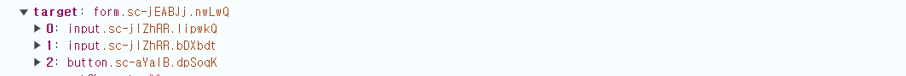

# SignUp 탭

## 위치

src-pages-main-\_conponents-sign-in-form.jsx

## 주변 컴포넌트

[Main.jsx](./summary2_Main.md)  
&emsp;|||  
sign-in-form.jsx <-SignUpForm.jsx  
&emsp;|||  
[FormInput.jsx](), [TDButton.jsx](), style.js

## 기능

-   알맞는 아이디, 비밀번호를 입력하고 로그인 버튼을 누르면 todo 페이지로 이동한다.
-   Form과 Button이 모이는 공간이다.

## 동작 원리

### 1. handlePressSignIn 함수

-   (1) event.preventDefault()

    -   원래 form 태그는 action 속성에 저장된 파일로 데이터를 전송한다.
    -   이거 안 하면 입력한 데이터가 url 창에 그대로 뜬다 == 다른 페이지로 이동했다.

-   (2) event
    -   함수가 onSubmit 이벤트 안에 들어가므로 event는 submit 이벤트이고 배열이다.
        
    -   첫번째 요소가 email 입력 창이고, 두번째 요소가 password 입력창이며 세번째 요소는 로그인 버튼이다.
    -   따라서 이러한 구조 분해 할당이 가능하다.
        `const { email, password } = event.target;`
    *   중괄호 안 키값으로 요소를 찾으므로 event.target 내부 요소의 순서가 바뀌어도 오류 나지 않는다.
    *   모든 input 태그에는 value라는 값에 접근할 수 있는 키가 있으므로 그 키로 입력된 값에 접근한다.

*   (3) 입력된 값에서 앞 뒤 공백을 제거했을 때 빈 값이면 함수를 종료한다. (백앤드가 있다면 데이터 전송이 되지 않게 하기 위한 조치)
*   (4) 입력된 값이 정해둔 값과 일치하면 navigate 함수로 todo 페이지로 이동한다.
*   (5) 값이 틀리면 위 2개의 if문 중 어느 쪽에도 못 들어가므로 alert가 실행된다.

### 2. return 문

-   아래 나오는 모든 요소는 다른 곳에서도 쓰이므로 컴포넌트로 분리했다.
-   (1) S.Form([style.js])
-   (2) FormInput
    ([공용 컴포넌트 FormInput.jsx]())
-   (3) TDButton([공용 컴포넌트TDButton.jsx]())
